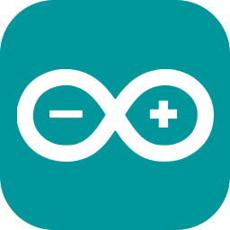
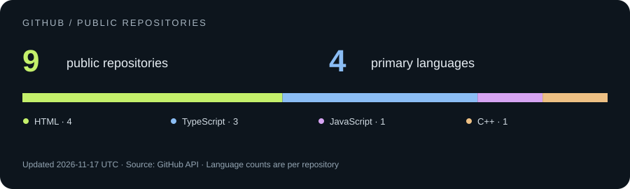

# Engineering, software and creative work

I'm haammkaki, a mechanical engineering undergraduate at Universitas Udayana in Bali. I build browser tools for engineering calculations, experiment with interactive spaces and develop clothing concepts through AFTER WANTING.

**[Explore my portfolio](https://trustnopeps.github.io/trustNOpeps/)**

## 🧭 About me

I'm a mechanical engineering undergraduate at **Universitas Udayana**. I use engineering thinking, research and AI-assisted development to build practical tools, explore digital products and develop creative concepts.

- **Building:** BOURN, a Bali trip-planning prototype, and VI Fieldnotes, an independent editorial website.
- **Exploring:** hospitality workflows with Tamuform Studio and clothing concepts through AFTER WANTING.
- **Learning:** reliable web applications, testing, databases and the business behind a useful product.
- **Open to:** remote opportunities, thoughtful collaborations and conversations that turn an idea into a working prototype.

## 🛠 Tech Stack & Tools

Tools and technologies I've used across engineering, product development, creative work and AI-assisted workflows. This is a practical toolset, not a proficiency rating.

**Web development**

      

HTML · CSS · JavaScript · TypeScript · React · Next.js · Tailwind CSS

**Backend & databases**

    

Python · FastAPI · Supabase · PostgreSQL · SQLite

**Development & deployment**

       

VS Code · Git · GitHub · GitLab · GitHub Pages · Cloudflare · Render · Google Antigravity

**Engineering & simulation**

   

MATLAB · Simulink · Arduino · Tinkercad

**Design & creative production**

      

Figma · Canva · Adobe Photoshop · Adobe Illustrator · Adobe Premiere Pro · Adobe Lightroom · CapCut

**AI & product development**

     

ChatGPT · OpenAI Codex · Claude · Gemini · Perplexity · Lovable

**AI media production**

   

Kling AI · Higgsfield · Google Flow · Suno

**Productivity & analytics**

      

Microsoft Word · Microsoft Excel · Microsoft PowerPoint · Google Docs · Google Sheets · Google Analytics · Google Search Console

Next.js and Supabase are used in the BOURN prototype; its connected authentication remains unverified. Higgsfield and Google Flow use text badges; Simulink uses a MathWorks family mark and Codex uses an OpenAI family mark. [Icon sources](assets/profile/tools/SOURCES.md).

## 🚀 Selected projects

| Project | What you can explore | Open |
| --- | --- | --- |
| **BOURN** | Bali travel planning prototype with recommendations, illustrative cost estimates and downloadable trip briefs. | [Live demo](https://trustnopeps.github.io/trustNOpeps/bourn/) · [Source](https://github.com/trustNOpeps/bourn) |
| **VI Fieldnotes** | Independent editorial website with searchable guides, a storage calculator and a browser-saved checklist. | [Live website](https://vi-fieldnotes.pages.dev/) · [Case study](https://github.com/trustNOpeps/vi-fieldnotes/blob/main/docs/portfolio-case-study.md) · [Source](https://github.com/trustNOpeps/vi-fieldnotes) |
| **Tamuform Studio** | Hospitality website and inquiry CRM pilot, with a public case study and fictional examples. | [Case study](https://trustnopeps.github.io/trustNOpeps/tamuform/) · [Project notes](projects/tamuform-studio.md) |
| **MechLabs** | Calculate stress and strain, compare material inputs and save runs locally. | [Workbench](https://mechlabs-engineering.lovable.app/) · [Source](https://github.com/trustNOpeps/Mechlabs) |
| **Tensile Desk** | Follow a force–extension dataset from raw CSV to an engineering stress–strain curve. | [Try the synthetic example](https://trustnopeps.github.io/trustNOpeps/apps/tensile-desk/) · [Method and tests](https://github.com/trustNOpeps/Tensile-Desk) |
| **Little World** | Explore a pixel-art office by selecting desks, assigning tasks and following scripted coworkers. | [Enter the office](https://trustnopeps.github.io/trustNOpeps/apps/little-world/) · [Source](https://github.com/trustNOpeps/Little-World) |
| **AFTER WANTING** | Browse ten clothing concept collections, including garment studies with front and back views. | [Visit the showroom](https://trustnopeps.github.io/trustNOpeps/showroom/) · [Design notes](projects/after-wanting.md) |

## 🧪 More experiments

- **[Mechatronics Lab](https://github.com/trustNOpeps/Mechatronics-Lab)** pairs an ultrasonic sensor with a servo in an Arduino simulation. The repository documents the wiring, threshold logic and limits of the virtual observations.
- **[Request Desk](https://trustnopeps.github.io/trustNOpeps/apps/request-desk/)** turns item specifications and quantities into an exportable quotation request. [Source](https://github.com/trustNOpeps/Request-Desk)
- **[Pixel Desk](https://trustnopeps.github.io/trustNOpeps/apps/pixel-desk/)** combines a searchable project gallery with a 16 × 16 drawing pad and PNG export. [Source](https://github.com/trustNOpeps/Pixel-Desk)
- **[Berpikir di Era AI](https://trustnopeps.github.io/trustNOpeps/book/)** is an Indonesian nonfiction book in development. Read the public preview.

## 🎨 Product design studies

Three anonymized website concepts cover [procurement catalogues](projects/procurement-website.md), [property development](projects/property-company-website.md) and [hospitality](projects/hospitality-website.md).

## 📊 GitHub at a glance

This dated snapshot uses GitHub's public repository data. Language counts describe repositories, not expertise or contribution totals. [See my actual contribution activity on GitHub →](https://github.com/trustNOpeps?tab=overview)

## 🤝 Let's build something useful

I enjoy discussing ideas across engineering, digital products and creative work. If you're exploring a problem or looking for someone to help shape a prototype, [connect on LinkedIn](https://www.linkedin.com/in/muhamad-hamka/en/).

<strong>Project status, methods & verification</strong>

My independent projects use AI-assisted development. Engineering tools are educational and use clearly labeled synthetic examples. BOURN is a planning prototype, Tamuform is a pilot with fictional public previews, and AFTER WANTING is at the concept stage.

Run standalone JavaScript tests with `npm test` from this repository. MechLabs has separate [engineering tests](apps/mechlabs/src/test/engineering.test.ts) and a [build workflow](.github/workflows/mechlabs-ci.yml). The portfolio website is published from `gh-pages`; this profile README is maintained on `main`.

[Portfolio design notes](docs/portfolio-design-qa.md) · [Profile assets and maintenance](docs/profile-maintenance.md)

